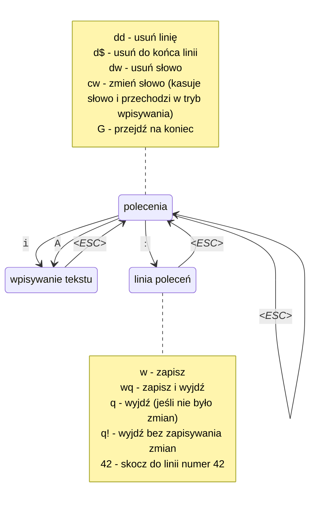

# Szkolenie z gita

## Prowadzący

Mateusz Adamowski

Strona internetowa: <https://mateusza-szkolenia.github.io/>

Repozytorium szkolenia: <https://github.com/mateusza-szkolenia/2024-04-alx-git.git>

## Instalacja

### Windows

<https://git-scm.com/download/win>

### macOS

- dostępny w paczce [XCode](https://developer.apple.com/xcode/)
- `brew install git`

### Linux

- Debian, Ubuntu: `apt-get install git tig`
- EL: `dnf install git`

## Podstawowe polecenia

### `git init`

Stworzenie nowego repozytorium w bieżącym katalogu.

**Uwaga! Najpierw należy założyć pusty katalog i wejść do niego**

```
mkdir moj_nowy_projekt
cd moj_nowy_projekt
git init
```

### `git status`

Sprawdzenie statusu zmian w bieżącym repo.

### `git diff`

Sprawdzenie zmian we wszystkich plikach.

Lub: `git diff plik.c` - tylko w jednym pliku.

Lub: `git diff *.cs` - tylko w plikach z rozszerzeniem `.cs`

Opcja `--word-diff` - pokazuje zmiany wewnątrz linii zamiast całych linii.

### `git add`

Dodawanie plików lub zmian do najbliższego commitu.

Wycofanie dodania: `git restore`

### `git commit`

Zatwierdzenie zmian wcześniej dodanych przez `git add`

- `git commit -m "Wiadomość"` - natychmiastowe zatwierdzenie, bez uruchamiania edytora
- `git commit plik.cs -m "Wiadomość"` - natychmiastowe zatwierdzenie zmian w wybranym pliku, niezależne od wcześniej dodanych plików.

Dodatkowe opcje:

- `--author="Imię Nazwisko <imie.nazwisko@example.com>"` - wskazanie innego autora zmian (email można pominąć, jeśli autor już występuje w historii)
- `--date=2000-01-01` - zmiana daty commitu (może być też `--date=now`)

#### `git commit --amend` Poprawianie ostateniego commitu

- `git commit --amend` - edycja opisu
- `git commit --amend --date=now` - ustawienie bieżącej daty
- `git commit --amend --author="Adam Mickiewicz <adam.m@example.com>"` - zmiana autora kodu
- `git commit --amend --reset-author` - przywrócenie autorstwa na bieżącego użytkownika
- `git commit --no-edit` - opcja przydatna, jeśli tylko zmieniamy datę lub autora i nie chcemy zmieniać opisu.

**Uwaga!** Operacja `amend` powoduje przepisanie historii, a więc może prowadzić do bałaganu w zdalnym repo, jeśli inne osoby pracują na tej samej gałęzi.

### `git branch`

- `git branch xxxx` - stworzenie gałęzi
- `git branch -d xxxx` - usunięcie gałęzi (tylko pod warunkiem, że była scalona)
- `git branch -D xxxx` - usunięcie gałęzi (nawet jeśli oznacza utratę comittów)
- `git branch` - lista gałęzi
- `git branch -r` - lista znanych zdalnych gałęzi
- `git remote prune origin` - wyczyszczenie zdalnych gałęzi, których nie ma już na serwerze

### `git switch`

Przełączanie się między gałęziami.

- `git checkout` - stare polecenie o tej samej funkcjonalności (oraz kilku innych)

- `git switch -c xxxx` - utworzenie nowej gałęzi i przełączenie się na nią

### `git merge`

Scalanie zmian.

### `git rebase`

1. "Przenoszenie" gałęzi w inne miejsce. (`git switch ABC-999; git rebase master`)
2. Przepisywanie historii (`git rebase -i`), obejmujące:
    - zmianę kolejności commitów
    - usuwanie wybranych commitów
    - łączenie commitów w jeden
    - edycję opisów commitów
    - itp

### `git reset --hard XXXXXXX`

Przywrócenie bieżącej gałęzi do dowolnego wybranego stanu. (Najczęściej sprzed merge, rebase itp)

### podpisywanie cyfrowe commitów

```command
$ git config --global user.signingkey ~/.ssh/id_ed25519.pub
$ git config --global gpg.format ssh
$ git config --global commit.gpgsign true
```

#### Rozwiązywanie konflików scalania

1. Przeedytować pliki z konfliktami. Rozwiązać konflikty ręcznie.
2. `git add .`
3. `git merge --continue`


### `git config`

Konfiguracja gita. Należy wykonać ten krok jednorazowo przed pierwszym commitem.

```
git config --global user.name "Imię i Nazwisko"
git config --global user.email "imie.nazw@example.com"
```

### `git stash`

Natychmiastowe ukrycie wszystkich niezacommitowanych zmian w bieżącym repozytorium.

Zmiany znikają z plików, ale można je przywrócić później lub na innej gałęzi polecenim `git stash pop`.

Zmiany będą też widoczne w grafie wyświetlanym poleceniem `tig --all`

### `git tag`

Nadanie taga na bieżący commit.

Tagi służą głównie do oznaczania numerów wersji (wydań).

Tag może być dowolnym słowem, ale wygodnie używać numerów wersji typu `v0.0.1`, `v1.2.4`

Polecam lekturę dokumentu dotyczącego semantycznego wersjonowania: <https://semver.org/>

Tagi można połączyć z workflowem, który będzie budował i pakował wydanie i oznaczał je numerem wersji.

### `git revert`

Wycofanie zmian ze starego commita bez modyfikacji historii, czyli poprzez stworzenie kolejnego commita z odwrotnymi zmianami.


### Reflog

Rejestr referencji - dziennik wszystkich stanów gałęzi, również ulotnych - powstałych w wyniku operacji `amend` itp

Automatycznie czyszczony co 60 dni. (chyba)

Obsługa polecenim `git reflog`


## `tig`

Strona domowa: <http://jonas.github.io/tig/>

Tig to pomocniczy program służący do przegladania historii gita. Jest domyślnie instalowany w pakiecie *Git for Windows*

### nawigacja

- przesuwanie widoku zmian: `j` `k`
- tryb blame: `b`
- tryb drzewa: `t`
- wyjście: `q`

### `tig nazwapliku.c`

Pokazuje historię danego pliku (tylko commity zmieniające ten plik)

### `tig blame nazwapliku.c`

Pokazuje kto i kiedy (w jakim commicie) dodał daną linię tekstu.

### `tig 0a010a01`

Pokazuje wskazany commit i jego historię.

### `tig --all`

Pokazuje wszystkie dostępne gałęzie.

## SSH

Tworzenie klucza: `ssh-keygen`

Wyświetlanie klucza publicznego: `cat ~/.ssh/id_25519.pub`

## bash

Znajdowanie poprzedniego polecenia `ctrl + r`

## vim




## Pan Tadeusz

> Litwo, ojczyzno moja, ty jesteś jak zdrowie
